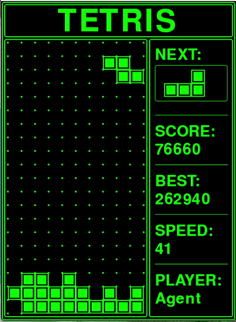
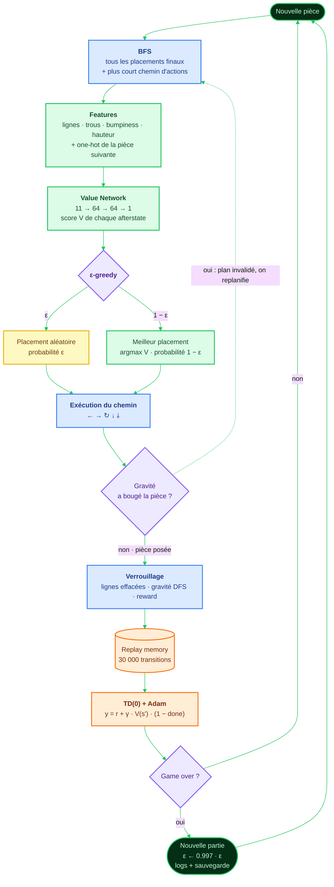
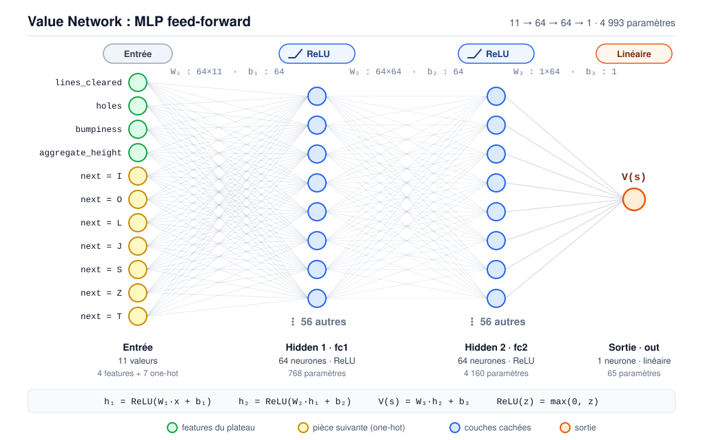
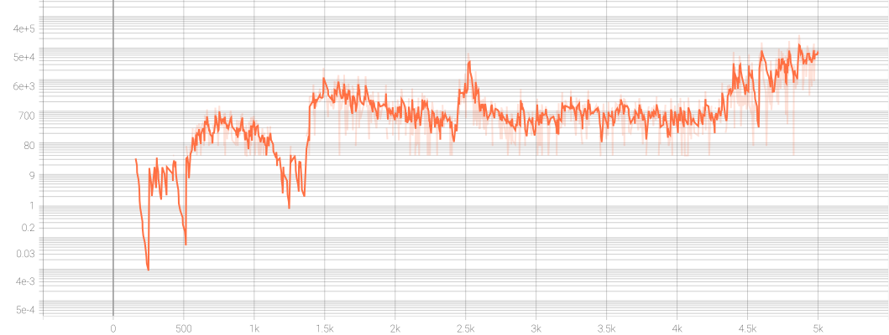
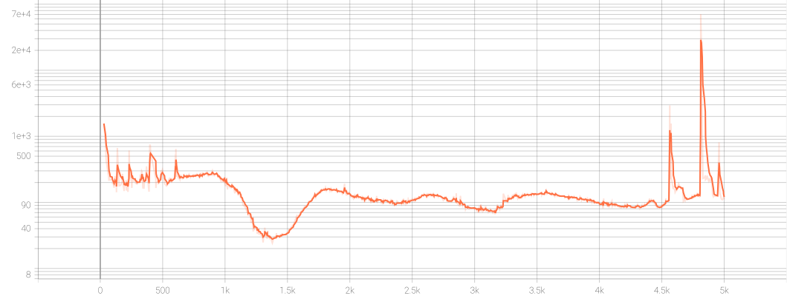
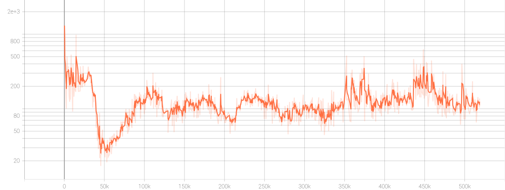

# 🟩 TETRIS_RL : un agent qui apprend à jouer à Tetris


<p align="center">
  
</p>

**TETRIS_RL** est un projet complet d'**apprentissage par renforcement** : un moteur Tetris écrit de zéro en Python/Pygame, un chercheur de chemins (BFS) et un agent PyTorch qui apprend seul à jouer, sans aucune donnée humaine.

Le **meilleur score de l'agent est de 262 940** (contre 395 pour le meilleur score humain enregistré dans `best_score.txt`).

---

## 📖 Table des matières

- [Le moteur de jeu](#️-le-moteur-de-jeu)
- [L'agent : méthode de RL utilisée](#-lagent--méthode-de-rl-utilisée)
- [Résultats et courbes d'entraînement](#-résultats-et-courbes-dentraînement)
- [Jouer soi-même](#️-jouer-soi-même)
- [Structure du dépôt](#-structure-du-dépôt)
- [Démarrage rapide](#-démarrage-rapide)
- [Technologies](#️-technologies)
- [Licence](#-licence)

---

## 🏗️ Le moteur de jeu

Le moteur (`tetris/tetris.py`) est la source de vérité : il gère les collisions, les rotations, les récompenses et la physique. Il est strictement séparé du rendu (`tetris/game_ui_render.py`), ce qui permet à l'agent de jouer à vitesse maximale et à un humain de jouer en temps réel à 30 FPS.

| Fonctionnalité | Description |
|---|---|
| **Grille** | 10 colonnes × 20 lignes, 7 tétriminos (I, O, L, J, S, Z, T) avec pièce suivante visible |
| **Wall Kicks** | 8 décalages testés successivement (dont 2 diagonales) quand une rotation est bloquée |
| **Gravité par amas** | Après un effacement de ligne, un **DFS** (voisinage à 8 directions) isole les amas de blocs ; ceux qui ne touchent pas le sol tombent jusqu'à s'ancrer |
| **Chutes unifiées** | Soft Drop, Hard Drop et gravité partagent la même logique de collision et de verrouillage |
| **Vitesse dynamique** | `speed = 1 + score // 500`, plafonnée à `MAX_SPEED = 41` ; l'intervalle de gravité passe de 500 ms à 50 ms minimum |
| **BFS de placements** | `find_final_states()` explore toutes les positions atteignables et renvoie chaque placement final avec le **plus court chemin d'actions** pour l'atteindre |

### Récompenses

À chaque verrouillage de pièce, l'environnement renvoie une récompense de lignes et un *reward shaping* dense.

| Lignes effacées | Récompense |
|---|---|
| 1 ligne | 3 |
| 2 lignes | 8 |
| 3 lignes | 16 |
| 4 lignes (Tetris) | 50 |

Le **reward shaping** ajoute un bonus de remplissage de ligne et un malus de −1 par trou créé sous la pièce posée, afin de guider l'agent avant même qu'il sache effacer des lignes.

Le **score affiché** est calculé séparément : chaque effacement rapporte `10 × (récompense + vitesse)`.

---

## 🧠 L'agent : méthode de RL utilisée

L'agent ne choisit pas une touche à chaque instant : **pour chaque pièce, il choisit directement où et dans quelle orientation la poser.** Le BFS de l'environnement se charge ensuite de trouver la séquence de touches qui y mène. Cela réduit énormément l'espace de décision (quelques dizaines de placements au lieu de suites de touches) et rend l'apprentissage bien plus stable.

### Vue d'ensemble de la boucle



🟦 environnement · 🟩 agent · 🟧 apprentissage · 🟪 décisions · 🟨 exploration

Le réseau ne s'entraîne qu'une fois la mémoire remplie (au moins 512 transitions).

### 1. Afterstates et Value Network

L'agent apprend une **fonction de valeur d'afterstate** `V(s)` : la valeur du plateau *juste après* avoir posé la pièce. C'est plus simple qu'un Q-learning classique, car les conséquences d'un placement sont déterministes ; il suffit d'évaluer chaque plateau résultant et de prendre le meilleur.

**Entrée du réseau (11 valeurs)** :

| Feature | Description |
|---|---|
| `lines_cleared` | Lignes complètes sur le plateau évalué |
| `holes` | Cases vides situées sous un bloc plein dans une même colonne |
| `bumpiness` | Somme des écarts de hauteur entre colonnes adjacentes |
| `aggregate_height` | Somme des hauteurs de toutes les colonnes |
| one-hot × 7 | Type de la pièce suivante |

**Architecture** : MLP `11 → 64 → 64 → 1` (ReLU), qui renvoie une valeur scalaire. Le réseau compte **4 993 paramètres** au total (768 + 4 160 + 65).

<p align="center">
  
</p>

### 2. Apprentissage TD(0)

L'entraînement se fait par **différence temporelle à un pas**, sur la chaîne des afterstates réellement joués. Notons $s_t$ le plateau avant le placement de la pièce $t$ (avec la pièce suivante), $s_{t+1}$ le plateau réel après verrouillage, et $r_t$ la récompense cumulée jusqu'au verrouillage (lignes + reward shaping).

**Cible TD(0)** :

$$
y_t = r_t + \gamma \, V_\theta(s_{t+1}) \, (1 - d_t)
$$

où $\gamma = 0.99$ est le facteur d'actualisation et $d_t \in \{0, 1\}$ vaut $1$ si la partie est terminée.

**Perte** (erreur quadratique moyenne sur un mini-batch $\mathcal{B}$ de 512 transitions tirées de la mémoire) :

$$
\mathcal{L}(\theta) = \frac{1}{|\mathcal{B}|} \sum_{t \in \mathcal{B}} \Big( V_\theta(s_t) - y_t \Big)^2
$$

**Mise à jour des poids** : le gradient est calculé sur $V_\theta(s_t)$ uniquement, la cible étant traitée comme une constante (`torch.no_grad()`), puis Adam met à jour les paramètres avec un pas $\alpha = 10^{-3}$ :

$$
\theta \leftarrow \theta - \alpha \, \text{Adam}\big(\nabla_\theta \mathcal{L}(\theta)\big)
$$

**Choix du placement** : parmi l'ensemble $\mathcal{A}_t$ des afterstates générés par le BFS, l'agent joue

$$
a_t = \arg\max_{s' \in \mathcal{A}_t} V_\theta(s')
$$

(sauf lors d'un tirage d'exploration, voir la section suivante).

Choix de conception :

- **Pas de max recalculé** pendant l'entraînement et **pas de réseau cible** : la cible utilise l'afterstate réellement atteint $s_{t+1}$, ce qui reste correct même quand la gravité par amas modifie le plateau différemment de la prédiction.
- **Experience Replay** : mémoire de 30 000 transitions $(s_t, s_{t+1}, r_t, d_t)$, mini-batchs de 512.
- **Perte** : MSE, optimiseur Adam.

| Hyperparamètre | Valeur |
|---|---|
| γ (discount) | 0.99 |
| Learning rate | 1e-3 |
| ε initial → minimal | 1.0 → 1e-3 |
| Décroissance de ε | ×0.997 par partie |
| Taille du batch | 512 |
| Taille de la mémoire | 30 000 |
| Nombre de parties | 5 000 |

### 3. Exploration

Politique **ε-greedy** : avec une probabilité ε, l'agent joue un placement aléatoire parmi les candidats ; sinon il joue celui dont la valeur prédite est maximale. ε décroît à chaque partie, de l'exploration pure vers l'exploitation.

### 4. Gestion de la gravité pendant l'entraînement

Le jeu tourne avec sa vraie gravité : la pièce descend pendant que l'agent exécute son plan. Quand la gravité déplace la pièce sans la verrouiller, le plan est **invalidé et recalculé** depuis la position réelle. Une transition n'est enregistrée qu'au **verrouillage effectif** de la pièce (détecté via le compteur `pieces_placed`), en utilisant l'état réel du plateau.

---

## 📈 Résultats et courbes d'entraînement

Les métriques sont suivies avec TensorBoard puis exportées en SVG.

**Meilleur score de l'agent : 262 940**

### Score par partie



### Perte moyenne par partie



### Perte à chaque étape d'entraînement



Pour rejouer les courbes : `tensorboard --logdir runs`

---

## ⌨️ Jouer soi-même

Le jeu est entièrement jouable par un humain avec `python main.py`.

| Touche | Action |
|---|---|
| `←` / `→` | Déplacer la pièce |
| `↓` | Chute douce (Soft Drop) |
| `↑` | Chute instantanée (Hard Drop) |
| `Espace` | Rotation |
| `Entrée` | Relancer après un Game Over |

Pendant l'entraînement (`python train.py`), la touche `V` active ou désactive l'affichage. Sans affichage, l'entraînement tourne bien plus vite.

---

## 📂 Structure du dépôt

```text
TETRIS_RL/
│
├── tetris/                          # Package : moteur du jeu
│   ├── __init__.py
│   ├── CONSTANTS.py                 # Dimensions, couleurs, vitesse maximale
│   ├── game_ui_render.py            # Rendu Pygame (style terminal vert)
│   ├── tetrimino.py                 # Matrices de rotation des 7 pièces
│   └── tetris.py                    # Moteur : collisions, récompenses, gravité DFS, BFS
│
├── agent.py                         # Features, Value Network, Agent (ε-greedy, TD(0), replay)
├── train.py                         # Boucle d'entraînement + logs TensorBoard
├── main.py                          # Mode humain
│
├── agent_weight.pth                 # Poids entraînés de l'agent
├── best_agent_score.txt             # Record de l'agent (262940)
├── best_score.txt                   # Record humain
├── runs/                            # Logs TensorBoard
│
├── tetris/                                            # Package : moteur du jeu
│   ├── preview.png                                    # Aperçu du jeu
│   ├── Progression_Score.svg                          # Courbe : score
│   ├── Progression_Mean-Loss.svg                      # Courbe : perte moyenne par partie
│   ├── Progression_Loss.svg                           # Courbe : perte par étape
│   ├── tetris_rl_agent_training_demo_compressed.mp4   # Vidéo de démonstration
│   ├── tetris_rl_agent_training_demo_compressed.gif   # Gif de démonstration
│   └── mlp_architecture.svg                           # Architecture du Value Network
│
├── requirement.txt
├── LICENSE
└── README.md
```

---

## 🚀 Démarrage rapide

### Prérequis

- Python 3.12+
- pip (GPU CUDA optionnel : détecté automatiquement par PyTorch)

### Installation

```bash
git clone https://github.com/MELSIDI/TETRIS_RL.git
cd TETRIS_RL
python -m venv trl_env
source trl_env/bin/activate        # Windows (Git Bash) : source trl_env/Scripts/activate
pip install -r requirement.txt
```

### Commandes

```bash
python main.py                      # Jouer en tant qu'humain
python train.py                     # Entraîner l'agent (charge agent_weight.pth s'il existe)
tensorboard --logdir runs           # Visualiser les courbes
```

---

## 🛠️ Technologies

- **Langage** : Python 3.12+
- **Apprentissage** : PyTorch (Value Network), TD(0), Experience Replay
- **Algorithmes** : BFS (placements et chemins), DFS (gravité par amas)
- **Rendu** : Pygame 2.6.1
- **Suivi** : TensorBoard, Matplotlib, tqdm, NumPy

---

## 📄 Licence

Distribué sous licence précisée dans le fichier [`LICENSE`](./LICENSE).